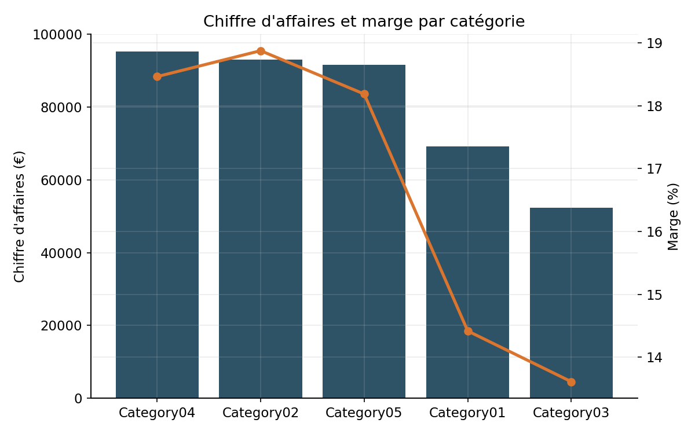
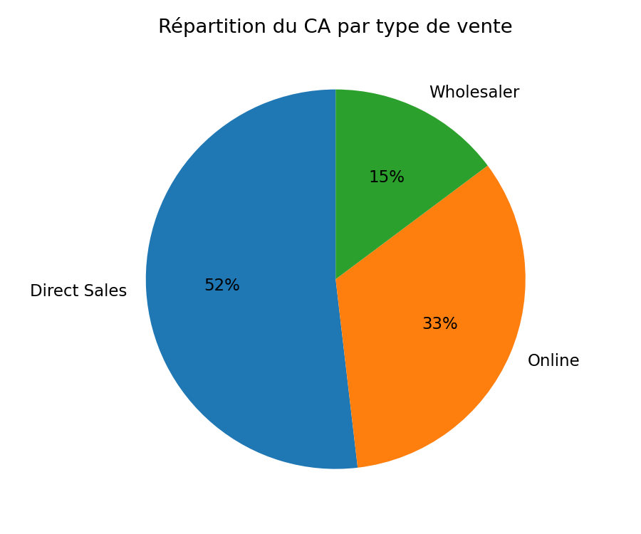
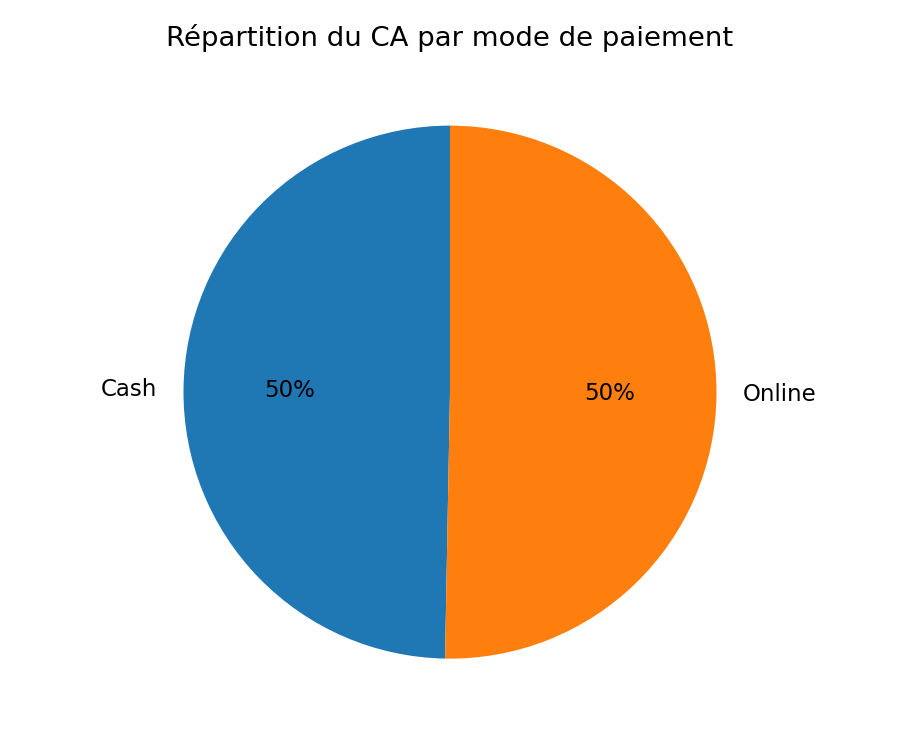
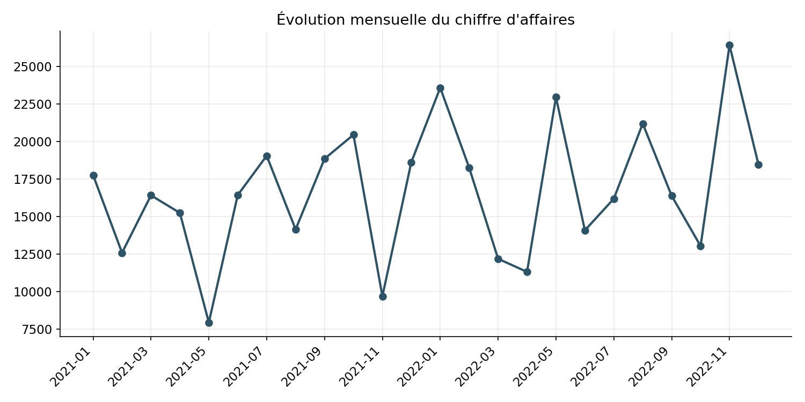
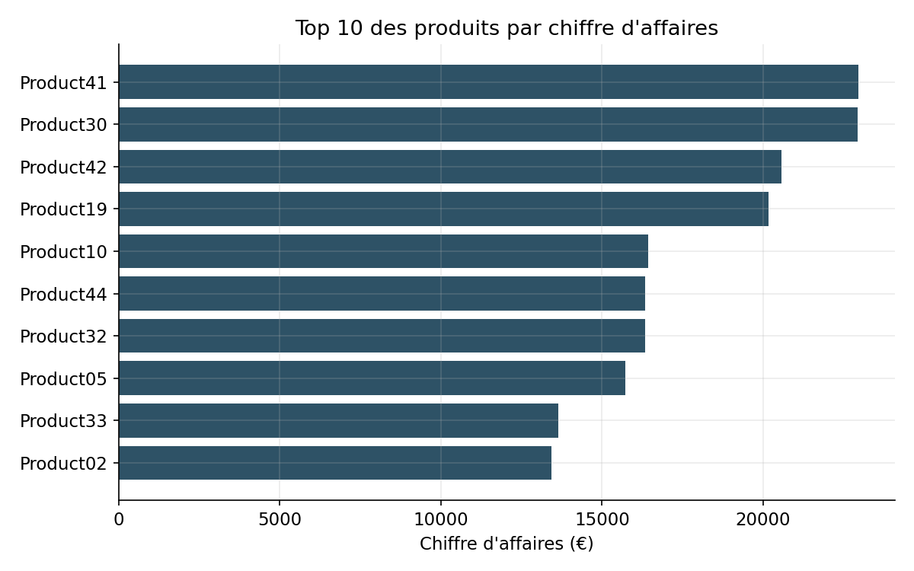

# 📊 Sales Performance Dashboard — Power BI + Python

Analyse des performances commerciales d'une entreprise fictive (2021-2022) : construction d'un
tableau de bord interactif sous Power BI, complétée par une analyse Python (pandas) pour extraire
des insights business concrets à partir des données brutes.

> Projet réalisé dans le cadre d'un exposé universitaire sur les techniques de dashboarding et de
> data visualization — Master 1 Science des données et aide à la décision, Université Abderrahmane Mira de Béjaïa.

## 🎯 Objectif

Transformer des données de transactions brutes en indicateurs de pilotage exploitables :
chiffre d'affaires, marge, performance par catégorie de produits, par canal de vente et par
mode de paiement, et évolution temporelle des ventes.

## 🗂️ Structure du repo

```
Sales-Dashboard-Project/
├── data/
│   ├── raw/
│   │   ├── input_data.csv      # 527 transactions (date, produit, quantité, canal, paiement, remise)
│   │   └── master_data.csv     # référentiel de 45 produits (catégorie, prix d'achat/vente)
│   └── sales_merged.csv        # données jointes + colonnes calculées (générées par le script)
├── notebooks/
│   └── analysis.py             # script pandas : jointure, KPI, graphiques
├── reports/
│   ├── dashboard_powerbi.pbix          # tableau de bord Power BI (filtres interactifs)
│   ├── presentation_dashboarding.pptx  # présentation de l'exposé
│   ├── rapport.pdf                     # rapport de l'exposé
│   └── README.md
├── images/                     # graphiques exportés (voir ci-dessous)
├── requirements.txt            # dépendances Python
└── README.md
```

## ⚙️ Méthodologie

1. **Préparation des données** : jointure de la table des transactions avec le référentiel produit,
   nettoyage des types (dates, pourcentages), calcul des colonnes dérivées (CA net, coût, profit).
2. **Modélisation Power BI** : mesures DAX pour le CA total, le profit total et la marge (%), relations
   entre les deux tables.
3. **Visualisation** : dashboard Power BI avec filtres (année, mois, catégorie, type de vente) +
   graphiques complémentaires générés en Python pour documenter les insights dans ce README.

## 📈 KPI globaux

| Indicateur | Valeur |
|---|---|
| Chiffre d'affaires total | **401 412 €** |
| Profit total | **68 908 €** |
| Marge globale | **17,2 %** |
| Période couverte | Janvier 2021 – Décembre 2022 |
| Transactions | 527 |

## 🔍 Insights clés

- **Les catégories ne se valent pas en rentabilité.** Category02 et Category04 dégagent une marge
  proche de 18-19 %, contre seulement 13,6 % pour Category03 — un écart de 5 points qui mérite d'être
  creusé (mix produit, coûts d'achat plus élevés ?) avant de pousser ces références.

  

- **La vente directe domine, mais pas de façon écrasante.** Elle représente ~52 % du CA, devant
  l'online (~33 %) et la vente en gros (~15 %) — un mix équilibré plutôt qu'une dépendance à un seul canal.

  

- **Le paiement est parfaitement partagé entre cash et en ligne** (~50/50), ce qui suggère que
  l'entreprise n'a pas intérêt à pousser un mode de paiement au détriment de l'autre à ce stade.

  

- **Le CA fluctue mais sans saisonnalité franche et récurrente** : les creux se situent plutôt au
  printemps (mars-mai) certaines années, mais le pattern n'est pas identique d'une année sur l'autre —
  contrairement à l'affirmation d'une "tendance saisonnière" faite dans l'exposé initial, la variation
  ressemble davantage à du bruit qu'à une saisonnalité stable.

  

- **Aucune remise n'a jamais été appliquée sur les 527 transactions** (`DISCOUNT % = 0` partout).
  Le champ existe dans le modèle de données et une visualisation lui est même dédiée dans le rapport
  original, mais il ne contient aucune information exploitable ici — un point à signaler comme
  limite du dataset plutôt qu'à illustrer comme un insight.

- **Concentration modérée des ventes** : le top 10 des produits (sur 45) réalise une part significative
  du CA, avec Product41 et Product30 en tête.

  

## ⚠️ Limites

- Dataset synthétique à but pédagogique (pas de données réelles d'entreprise) : les insights illustrent
  une méthodologie, pas une situation économique réelle.
- Le champ remise (`DISCOUNT %`) est vide sur toute la période — l'analyse des promotions n'a pas pu
  être menée malgré sa présence dans le modèle de données.
- Deux ans de données seulement : insuffisant pour confirmer une saisonnalité structurelle.

## 🛠️ Outils utilisés

- **Power BI** : modélisation, mesures DAX, dashboard interactif avec filtres
- **Python** (pandas, matplotlib) : jointure des données, calcul des KPI, génération des graphiques

## ▶️ Reproduire l'analyse

```bash
pip install -r requirements.txt
python notebooks/analysis.py
```

Le script peut être lancé depuis n'importe quel dossier : il régénère `data/sales_merged.csv`
et les graphiques du dossier `images/`.
